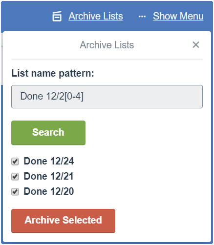

# trello-list-archiver

**trello-list-archiver** is a tiny Trello Power-Up that lets you archive a bunch of Trello lists in a few clicks. It uses regular expressions to match lists by title.

One of the scenarios when it may come handy (that inspired the creation of trello-list-archiver) is using Trello to track daily activities with each day represented by its own list. It makes it easier to reflect on the work done, fill any reports if you have to, run retrospectives, and much more. Once lists are not needed anymore, i.e., at the end of a month, you can archive them all in a few clicks.

## Installation
To install custom Trello Power-Up, you have to be an admin of a team. You can either create a new or use an existing team.
Once you have a team, install Power-Up via https://trello.com/power-ups/admin/ page. See also an official guide about [Managing Power-Ups](https://developers.trello.com/v1.0/docs/managing-power-ups) for additional details.
### Pre-requisite: create a team
1. Navigate to Trello Home via https://trello.com/
2. Create a team by clicking a plus icon on the left sidebar
3. Open the board(s) where you want to add trello-list-archiver and assign them to the newly created team by clicking on _Personal_ next to the board title

### Add trello-list-archiver to the team
1. Navigate to https://trello.com/power-ups/admin/
2. Click on the team name
3. Click _Create a Power-Up_ button
4. Fill _Required Fields_ as follows:
    * **Power-Up name:** list-archiver
    * **Power-Up Capabilities:** authorization-status, board-buttons, callback, show-authorization
    * **Iframe connector URL:** https://mshatalov.github.io/trello-list-archiver/
    * **Does your Power-Up store personal data?:** No
5. Click _Done_
6. Navigate to the board, click *Show Menu - Power-Ups - Custom*
7. Click _Enable_ next to _list-archiver_ Power-Up

## Usage
**trello-list-archiver** shows up in the top bar as *Archive Lists* button. On the very first use, it'll prompt you to authorize the Power-Up to access your Trello account — it's required to modify lists via [Trello REST API](https://developers.trello.com/reference/).

Once authenticated, put a [regular expression](https://developer.mozilla.org/en-US/docs/Web/JavaScript/Guide/Regular_Expressions) in the search box and press Enter or click _Search_. Uncheck any matched lists if necessary, and click _Archive Selected_.

Voila! If you removed something important accidentally, there is still a chance to fix it by clicking _Undo Selected_.

Enjoy!

## Troubleshooting
In rare cases when authentication token expires or invalidates, you may need to reauthenticate the Power-Up by navigating to *Show Menu - Power-Ups - Custom*, clicking a gear icon next to the trello-list-archiver and choosing _Remove Personal Settings_.

After that, click the gear button again, select _Authorize Account_, and follow the prompts to authorize 

## Code
Feel free to fork **trello-list-archiver** or suggest a pull request. The Power-Up was originally hosted at [Glitch](https://glitch.com) which is a nice platform to experiment with the code, but has moved to GitHub Pages since then.

## Acknowledgments
Made by [Mikhail Shatalov](https://github.com/mshatalov).  
Archive icon is based on the original icons from Trello at https://design.trello.com/style/icons.